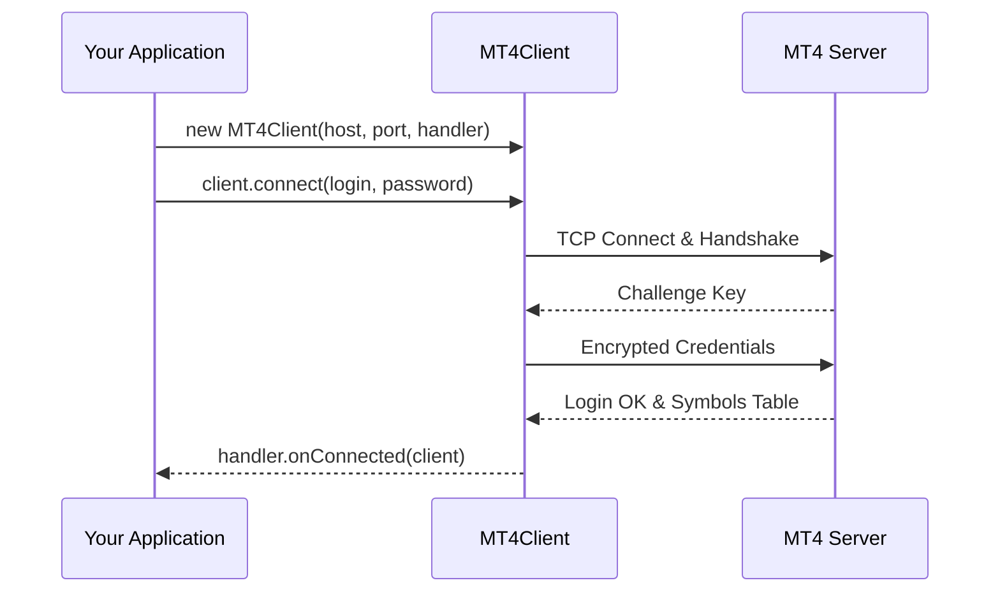

# Connection & Authentication

The `MT4Client` class manages the lifecycle of the TCP socket connection, encrypted handshake, and authentication with the MetaTrader 4 server.

## Connection Lifecycle



## Connecting to a Broker

To establish a connection, instantiate `MT4Client` with the server hostname, port, and a `MessageHandler` implementation:

```java
MT4Client client = new MT4Client("mt4demo.broker.com", 443, new MessageHandler() {
    @Override
    public void onConnected(MT4Client client) {
        System.out.println("Session connected and authenticated.");
    }

    @Override
    public void onMessage(MetaTraderMessage message, MT4Client client) {
        // Handle incoming messages
    }

    @Override
    public void onDisconnected(IOException exception, MT4Client client) {
        System.err.println("Session terminated: " + exception.getMessage());
    }

    @Override
    public void onReceiveFailure(DecoderException e) {
        System.err.println("Decoder failure: " + e.getMessage());
    }

    @Override
    public void onSendFailure(Exception e) {
        System.err.println("Send failed: " + e.getMessage());
    }
});

// Start asynchronous connection
client.connect(1002345, "investor_or_master_password");
```

## Connection State Verification

You can query connection state anytime:

```java
// Check if initial handshake and base account synchronization is finished
if (client.isBaseAccountRead()) {
    System.out.println("Ready to send trading operations!");
}

// Server build info
int build = client.getLoginHelper().getServerBuild();
System.out.println("Server MT4 build version: " + build);
```

## Graceful Disconnection

Always close client connections cleanly when terminating:

```java
client.disconnect();
```
