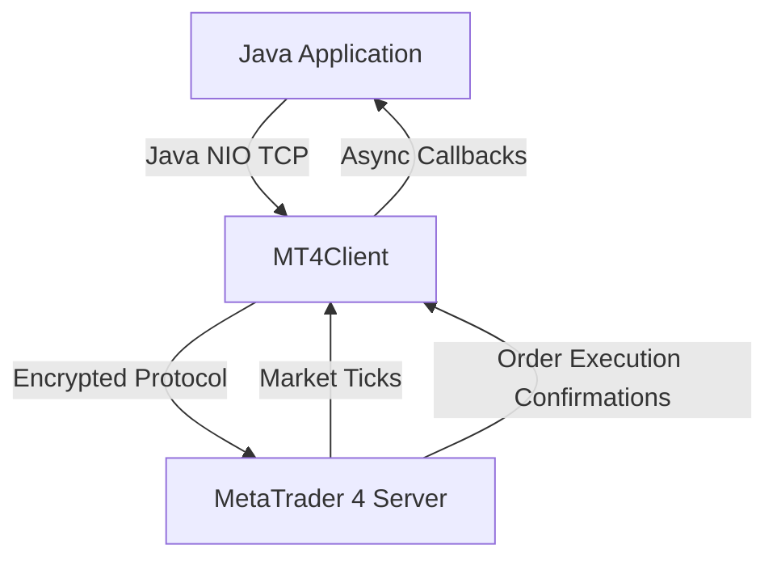

# JavaMT4 SDK

Welcome to the **JavaMT4 SDK** documentation. This high-performance, non-blocking Java client connects directly to MetaTrader 4 servers via standard TCP sockets using Java NIO without requiring any local MetaTrader 4 terminal application or Wine installation.

## Key Features

- **Direct TCP Connection**: Connects straight to MetaTrader 4 servers with low latency.
- **Java NIO Architecture**: Non-blocking asynchronous event-driven I/O.
- **Zero External Terminal Dependencies**: Pure Java solution running natively on Linux, macOS, and Windows.
- **Full Trading Automation**: Market orders, pending orders (buy limit, buy stop, sell limit, sell stop), stop loss & take profit management, and position closing.
- **Real-Time Market Data**: Live quote subscriptions, tick data, order book, and historical bar queries.
- **Account Management**: Real-time margin, equity, balance, and leverage tracking.

## Architecture



## Quick Installation

### Gradle
```groovy
repositories {
    mavenCentral()
}

dependencies {
    implementation 'io.metarpc:javamt4:1.0.0'
}
```

### Maven
```xml
<dependency>
    <groupId>io.metarpc</groupId>
    <artifactId>javamt4</artifactId>
    <version>1.0.0</version>
</dependency>
```

Next, see the [Getting Started](getting-started.md) guide to connect and make your first trade.
